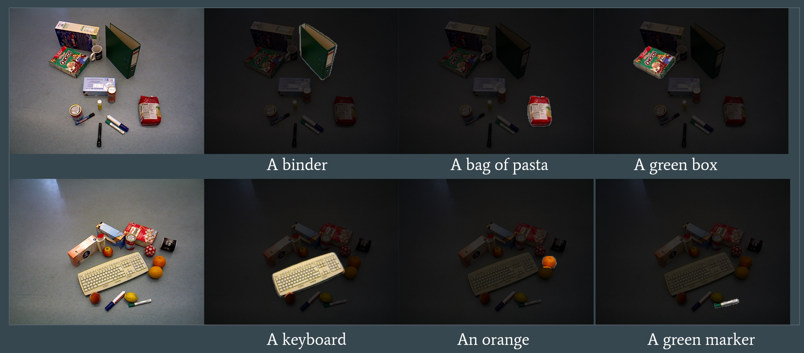

# Clip-Seg
MIT 6.843 Course Project. We use a simple idea for open-text semantic segmentation task. The code largely follows [Cliport](https://github.com/cliport/cliport) and [Uois](https://github.com/chrisdxie/uois). We hope this code can be used for robotic researchers that require good generalization property in language and vision-wise segmentation.

[Slide](https://docs.google.com/presentation/d/10X7pzc3wIvRkoD2O28ResuEQc4Fqq-T4RMatbtvL6iQ/edit#slide=id.p) [Report](assets/Report.pdf)



### Installation
```bash
git clone https://github.com/liruiw/Clip-Seg.git --recursive
```

0. Setup: Ubuntu 16.04 or above, CUDA 10.0 or above, python 3.6

1.  * Install Clip-Seg inside a new conda environment
	    ```angular2html
	    conda create --name clip-seg python=3.7
	    conda activate clip-seg
	    pip install -r requirements.txt
	    ```

2. Download Dataset [OCID](https://www.acin.tuwien.ac.at/en/vision-for-robotics/software-tools/object-clutter-indoor-dataset/), [OCID-Ref](https://github.com/lluma/OCID-Ref), [TOD dataset](https://drive.google.com/file/d/1itThz2GVBUAqXs3MaH92YWhoj0G6Mfg1/view)
 
3. Download pretrained models ```bash download_model.sh ```

4.  Example Scripts:

Test TOD 
``` python3 test_clipseg.py --model_suffix 100x100 --config_name full_TOD```


Train OCID 
``` python3 train_clipseg.py  --config_name ocid```


Demo OCID
``` python3 demo_clipseg.py  --config_name ocid```

Could be combined with learned [policy](https://github.com/liruiw/HCG) for picking demo ```robot_clipseg.py  ```

### Note
1. Please use Github issue tracker to report bugs. For other questions please contact [Lirui Wang](mailto:wangliruisz@gmail.com).
2. The Clip-Seg is licensed under the [MIT License](LICENSE).